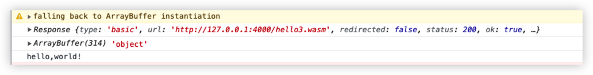

## 使用 Emscripten 的 wasm demo

### 安装 Emscripten
Emscripten包含了将C/C++代码编译为WebAssembly所需的完整工具集（LLVM/Node.js/Python/Java等）,不依赖于任何其他的编译器环境。

可以使用emsdk命令行工具安装Emscripten。

#### 下载emsdk
```
// 下载emsdk
$ git clone https://github.com/emscripten-core/emsdk.git
```

#### 安装并激活Emscripten
```
$ cd emsdk
// 运行以下emsdk命令从GitHub获取最新工具，并将其设置为活动状态
# 获取最新版本的emsdk (第一次clone项目的时候，忽略此操作)
git pull

# 下载按照最新的SDK工具
./emsdk install latest


# 针对当前用户，将最新的SDK设置为“激活状态”
./emsdk activate latest

# 激活当前终端中的路径和其他环境变量
source ./emsdk_env.sh
```

#### 校验安装
```
emcc (Emscripten gcc/clang-like replacement + linker emulating GNU ld) 3.1.34 (57b21b8fdcbe3ebb523178b79465254668eab408)
clang version 17.0.0 (https://github.com/llvm/llvm-project a031f72187ce495b9faa4ccf99b1e901a3872f4b)
Target: wasm32-unknown-emscripten
Thread model: posix
InstalledDir: /Users/zhaowang/Desktop/emscripten/emsdk/upstream/bin
```

### 生成.wasm文件
1. 新建hello.c文件
2. `emcc hello.c -o hello.js` 生成hello.js和hello.wasm
3. html中引入hello.js  搭建简单服务器运行  或者 直接node hello.js

### 在网页中直接使用wasm
1. 新建hello2.c文件
2. 使用Emscripten编译器将该代码编译为WebAssembly格式

`emcc hello2.c -o hello2.wasm -s WASM=1 -s EXPORTED_FUNCTIONS="['_main', '_add']"`
上面这条生成的hello2.wasm 在网页获取时报错`Imports argument must be present and must be an object`


在google搜索，更换成下面命令生成hello3.wasm
`emcc hello2.cc -O3 -s WASM=1 -s SIDE_MODULE=1 -s EXPORTED_FUNCTIONS='["_main", '_add']'  -o hello3.wasm `
好像没什么改变...

官方函数说明：instantiate(bufferArray,importObject);其中importObject可以省略，但是省略的前提是在wasm文件中没有使用到导入函数或导入属性。如果报这个错了，说明一定是用了导入函数或属性，所以你一定要传importObject进去。这个importObject提供了你在wasm中引用的函数或属性。当然你可能会问那我不知道提供了哪些函数怎么办，当你传一个空的对象进去时一定会发生下面一个错误。
`WebAssembly.instantiate(): Import #0 module="env" error: module is not an object or function`

总结： emcc编译的话，编译会生成 ***.js和***.wasm。直接加载js文件就可以啦，这个js文件会自动编译这个wasm文件的。
github上面作者是建议使用这个js文件来加载wasm文件而不是自己去加载wasm文件。
3. 嵌入html中
```
// 加载 wasm 模块
(async function fetchAndInstantiate() {
  const response = await fetch("hello3.wasm");
  console.log(response)
  const buffer = await response.arrayBuffer();
  console.log(buffer, typeof buffer)
  const obj = await WebAssembly.instantiate(buffer, {});
  console.log(obj)
  console.log(obj.instance.exports.add(1, 2));  // "3"
} )()
```
